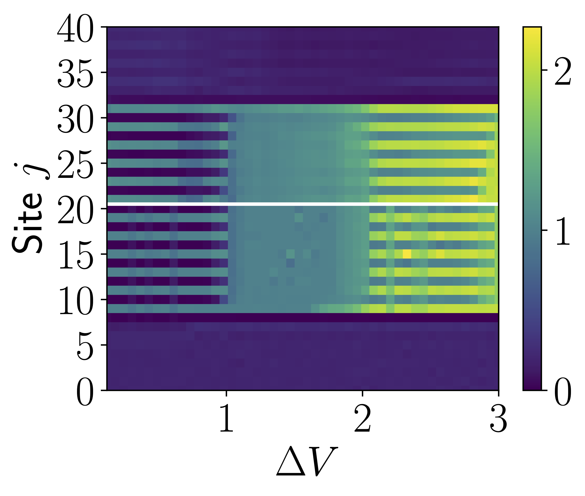
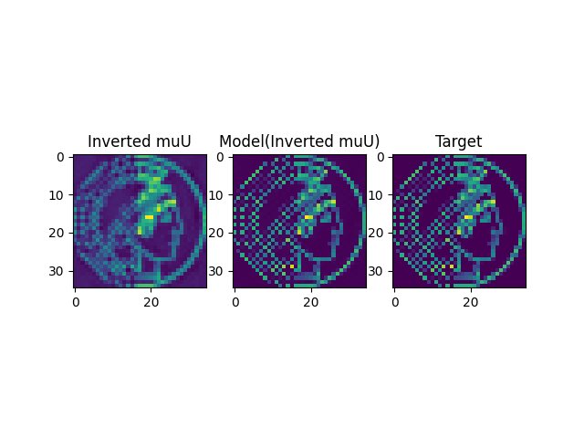

# Many Body Density Prediction

Code for the paper [Deep learning of spatial densities in inhomogeneous correlated quantum systems](https://arxiv.org/pdf/2211.09050)

## Bose Hubbard Model in 2D

### Data Generation

### Training

Model training is set up with [PyTorch Lightning](https://pytorch-lightning.readthedocs.io/en/stable/). The training script is `train.py`.

The model and training is configured with [Hydra](https://hydra.cc/).

### Inversion

